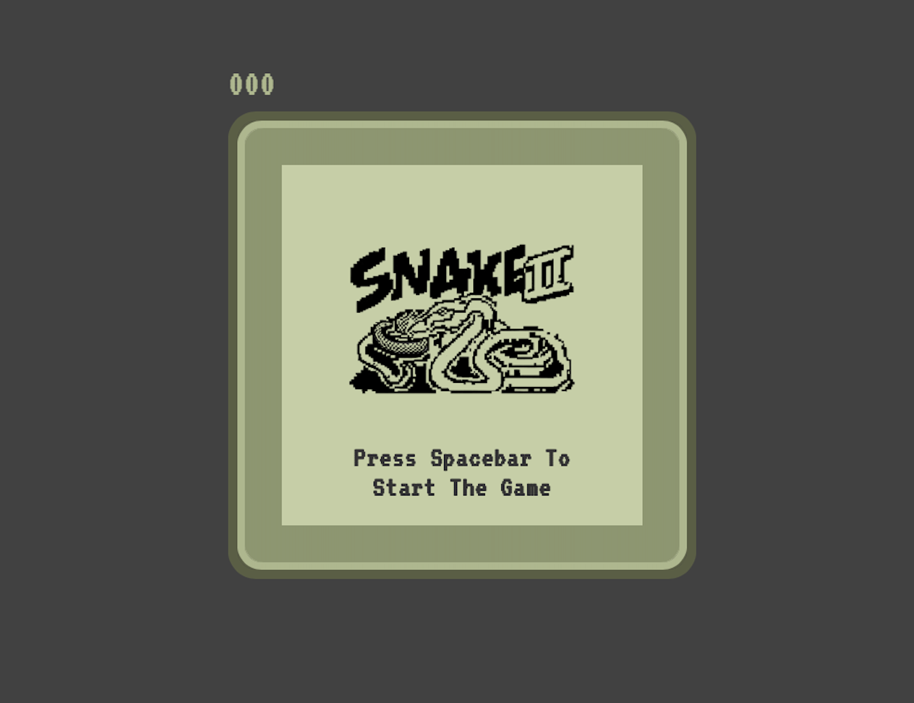
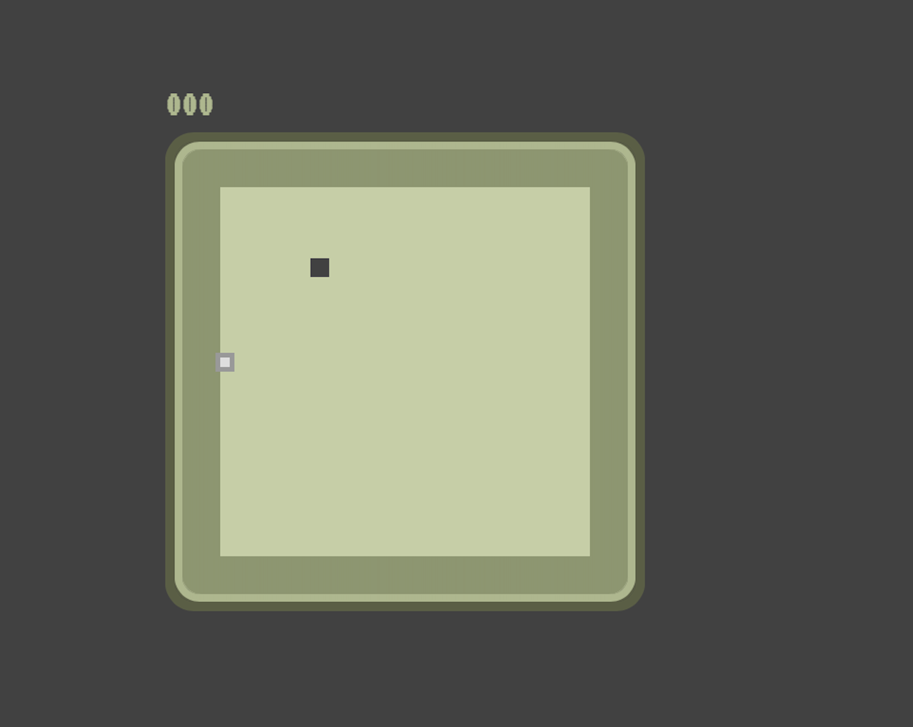
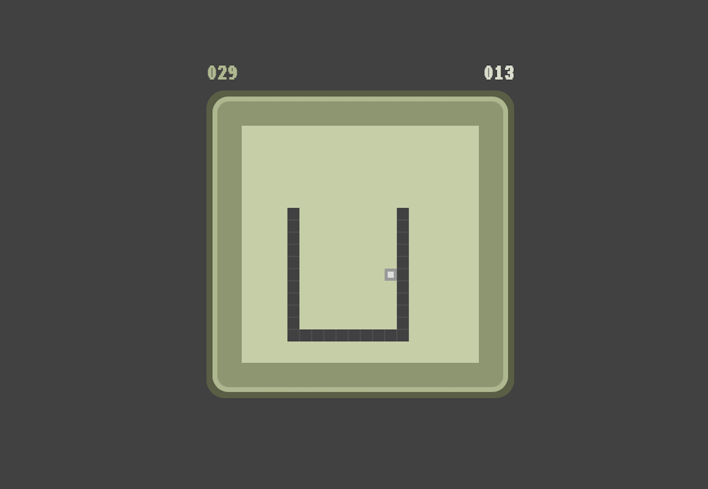
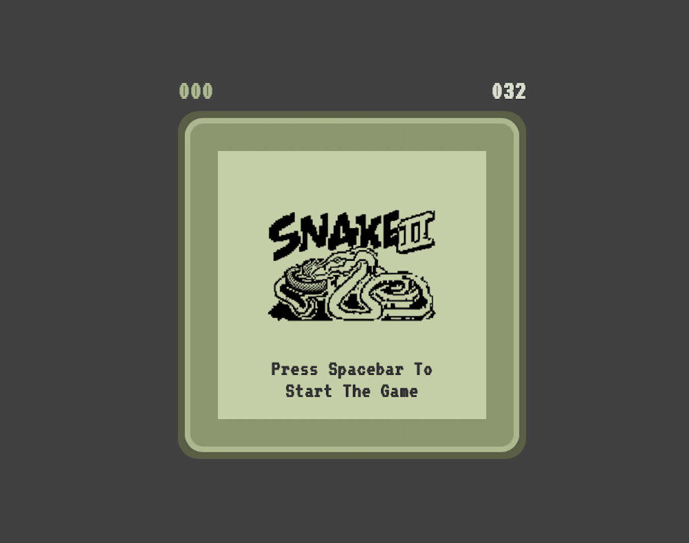

# Snake Game

Welcome to our version of the classic Snake game! Navigate the snake to eat food and grow as long as possible while avoiding walls and the snake's own tail. This game is built with HTML, CSS, and JavaScript, making it easily playable right from your web browser.

## Features

- **Classic Gameplay:** Enjoy the timeless gameplay of Snake, where each piece of food your snake eats makes it longer and the game faster.
- **Score Tracking:** Your current score and high score are tracked and displayed in real time.
- **Responsive Design:** Play the game on any device, thanks to its responsive design that adjusts to the size of your screen.
- **Keyboard Controls:** Use the arrow keys to change the direction of the snake.

## How to Play

1. **Start the Game:** Press the spacebar to start the game.
2. **Control the Snake:** Use the arrow keys (↑, ↓, ←, →) to control the direction of the snake.
3. **Eat Food:** Navigate the snake to the food. Each piece of food eaten makes the snake longer.
4. **Avoid Collisions:** Avoid hitting the walls or the snake's own body.
5. **Increase Your Score:** Try to eat as much food as possible to increase your score.

## Installation

No installation is required! Simply open the `index.html` file in your web browser to start playing.

## Screenshots

Replace the paths above with the actual paths to your screenshots.

## Contributing

We welcome contributions to improve the game. If you have a suggestion or bug fix, feel free to fork the repository, make your changes, and submit a pull request.

## License

This project is licensed under the MIT License - see the LICENSE.md file for details.

## Acknowledgments

- Special thanks to [Your Name or Your Team's Name] for development and design.
- Shoutout to anyone whose code was used as inspiration or directly included.

Enjoy playing the Snake game!
